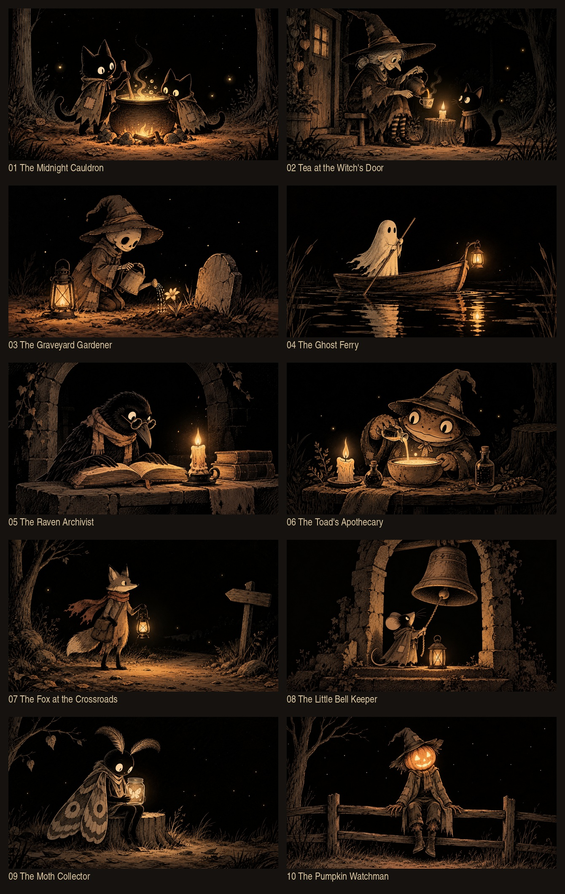

# Halloween scene assets — rendering and audio handoff

Ten different nighttime scenes are ready for selection and production: new
characters, actions and settings, with a shared black, muted sepia and amber ink
palette. The main characters must remain readable at thumbnail size, with candle
light concentrated around one focal source and subdued background detail.

The next stage belongs to Claude: choose a scene, prepare its layers, build the
loop, and develop a continuous two-hour soundtrack using the included DroneMill
audio workflow. These ten images are **flattened still concepts**. Their animation
and scene-specific sound palettes are proposed briefs, not completed renders.



| Scene | Full-resolution image | Motion and sound direction |
| --- | --- | --- |
| 01 · The Midnight Cauldron | [Cats and cauldron](scenes/01-cats-and-cauldron.png) | Slow stirring and steam; warm organ, soft bubbling and fire texture |
| 02 · Tea at the Witch's Door | [Witch making tea](scenes/02-witch-tea.png) | Kettle tilt and cat blink; gentle organ, rounded tines, quiet air |
| 03 · The Graveyard Gardener | [Skeleton gardener](scenes/03-skeleton-gardener.png) | Water droplets and flower sway; low choir, soft strings, delicate water texture |
| 04 · The Ghost Ferry | [Ghost in a boat](scenes/04-ghost-ferryman.png) | Boat bob and reflections; smooth drone, water and low wind |
| 05 · The Raven Archivist | [Raven reading](scenes/05-raven-archives.png) | Blink, beak dip, candle flicker; dark organ, strings and soft paper texture |
| 06 · The Toad's Apothecary | [Toad alchemist](scenes/06-toad-alchemist.png) | Vial tilt and steam; subdued bubbling, rounded tines and pad |
| 07 · The Fox at the Crossroads | [Fox traveler](scenes/07-fox-lantern-road.png) | Scarf, tail and lantern sway; wind, leaves and warm strings |
| 08 · The Little Bell Keeper | [Mouse and bell](scenes/08-mouse-bellkeeper.png) | Restrained bell and rope motion; sparse low bell partials and long tails |
| 09 · The Moth Collector | [Moth creature and jar](scenes/09-moth-collector.png) | Antennae and tiny moth motion; airy formants, softened high harmonics |
| 10 · The Pumpkin Watchman | [Pumpkin scarecrow](scenes/10-pumpkin-watchman.png) | Cloth and feet sway, pumpkin flicker; hollow organ, autumn wind and soft creaks |

## Assets and provenance

- [Scene manifest](scene-manifest.json): stable IDs, image paths, SHA-256 hashes,
  and individual motion/sound suggestions. Sound suggestions are not executable
  audio renderer configurations.
- [Exact generation prompts](scenes/prompts.json): one built-in `image_gen` call
  per scene, using the user-supplied screenshot as a mood/drawing-language
  reference. It was not used as an edit target. The reference screenshot is not
  included; its role and appearance are documented.
- [Earlier keeper studies](keeper-studies/comparison.jpg): ten framing/pose
  explorations of the same lantern keeper, retained separately for comparison.
  Their exact prompts are in [keeper-studies/prompts.json](keeper-studies/prompts.json).
- [Gallery](scenes/gallery.html): open locally after cloning; click each image
  for the full-resolution PNG. GitHub's Markdown preview above works online.
- [Loop prototype](loop-prototype/README.md): existing layered keeper animation,
  source art, code, a silent 48-second viewing copy and validation measurements.
  Its scenery and palette predate the new art direction; use its motion mechanics
  as a reference when producing the selected scene.
- [Asset inventory](asset-inventory.json): file sizes and SHA-256 hashes for the
  complete handoff, excluding the inventory itself.

The built-in generation workflow ran inside this Codex chat. This handoff stores
its output and prompts; it does not install an unattended image-generation
service on the production server. Existing phone-snapshot prompts in
`scripts/idea_generator.py` and `scripts/cover_generator.py` describe a separate
photographic visual style. Use this handoff's illustration prompts for these assets.

## Produce a visual loop

Prepare separate background, character, moving limb/prop and light masks for the
selected still. The new scenes do not yet have these layers. Preserve the character
identity, original ink edges and palette while creating them.

The prototype has a background PNG and transparent keeper/lantern cutouts. Its
native Python/OpenCV compositor evaluates poses from time, then encodes with
FFmpeg. Breathing, blinks, head tilt, lantern swing and candle light share a
24-second cycle. The atmosphere extension adds cloud wisps, low mist, leaves and
moon shading, with particles fading before wrapping. Choose only effects that
fit the new scene: for example the ghost ferry needs reflection motion rather
than falling leaves. The prototype's coordinates and masks are specific to the
keeper and must be redesigned for the selected characters.

Aim for a calm 24-second, 24 fps, 1920 × 1080 loop. Two hours is 300 repeats.
Keep the composition steady and motion small. Validate identical source poses
at time `t` and `t + 24`, and inspect at least two encoded cycles for a seam,
including light and particle changes. Preserve contact points such as feet,
seat edges and the boat/character relationship. Check a small thumbnail for
subject clarity before rendering the full loop.

## Develop the soundtrack

Start with the [audio handoff and listening previews](../../audio-samples/2026-10-09/README.md)
and the [portable renderer](../../../tools/audio-samples/README.md):

```sh
python3 -m pip install -r tools/audio-samples/requirements.txt
python3 tools/audio-samples/render.py --variant all
```

The reproducible comparison is the native DroneMill Lovecraft/D2 texture, then a
related native render using explicit per-note ADSR and slow amplitude, filter and
pan LFOs, processed by Songygen's public DSP algorithms locally in Node. The EQ
is **Contour EQ**, used to tame the upper range; no separate public effect named
"Tame" was identified. The chain also includes a blended compressor, slow phaser,
chorus, tape ping-pong delay and Dattorro-style plate reverb. The actual parameters
and pinned source provenance are in the existing audio recipe and tools.

Use these recipes as a starting point, then choose the scene's instrument and
environment palette from the manifest. Full-duration evolving music and texture
need a long-form recipe with carried effect state and reverb tails. The supplied
30-second previews have fades and are not seamless soundtrack loops. Stretch the
musical development over minutes and keep environmental detail quiet enough for
long listening. The visual cycle does not require a musical restart every 24 seconds.

Audition a short sound-design preview before rendering two hours. Validate the
full master for clipping, duration, stereo continuity and the desired production
loudness; the comparison samples' roughly -22 LUFS target does not redefine the
channel's mastering default. The new ten scenes have no generated soundtrack yet.

Once the final visual loop and a full-duration soundtrack exist, use the
[finishing helper](loop-prototype/finish-two-hours.py). It repeats video, copies
the H.264 stream, encodes audio to AAC, requires enough soundtrack duration, and
checks the resulting length. Claude owns the final rendering and integration;
this change adds assets, documentation and an isolated prototype.
